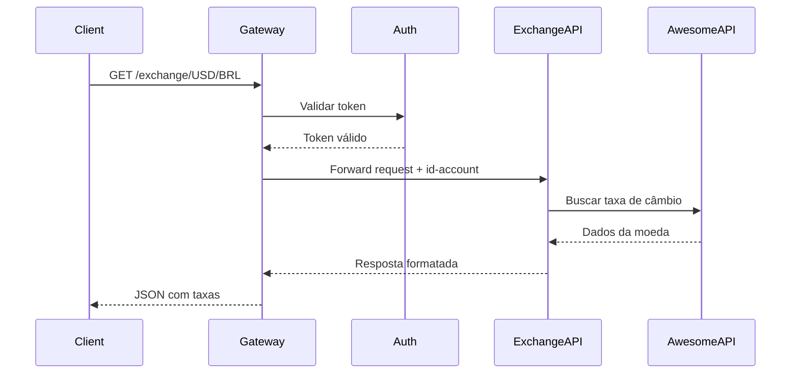

# Exchange API

## Objetivo

Desenvolver uma API REST para conversão de moedas utilizando FastAPI que permita aos usuários autenticados obter taxas de câmbio atualizadas entre diferentes moedas. A API deve integrar-se com serviços de terceiros para obter dados em tempo real e implementar um sistema de autenticação baseado em headers.

## Montagem do Roteiro

### Tarefa 1 - Configuração do Ambiente

Instalação das dependências necessárias:

<!-- termynal -->

```bash
pip install fastapi uvicorn httpx
```

### Tarefa 2 - Estrutura Base da API

Criação da aplicação FastAPI com configurações iniciais:

```python
from fastapi import FastAPI, HTTPException, Request
import httpx

app = FastAPI(
    title="Exchange API",
    description="API para conversão de moedas com autenticação",
    version="1.0.0"
)

BASE_URL = "https://economia.awesomeapi.com.br/json/last/"
```

### Tarefa 3 - Implementação do Cliente HTTP

Função assíncrona para consumir a API externa (AwesomeAPI):

```python
async def fetch_exchange_rate(from_currency: str, to_currency: str) -> dict:
    url = f"{BASE_URL}{from_currency.upper()}-{to_currency.upper()}"
    async with httpx.AsyncClient() as client:
        response = await client.get(url)
        response.raise_for_status()
        return response.json()
```

### Tarefa 4 - Endpoint Principal

Implementação do endpoint `/exchange/{from_currency}/{to_currency}` com autenticação:

```python
@app.get("/exchange/{from_currency}/{to_currency}")
async def get_exchange(from_currency: str, to_currency: str, request: Request):
    user_id = request.headers.get("id-account")
    if not user_id:
        raise HTTPException(status_code=400, detail="User ID is required in headers")
    
    try:
        data = await fetch_exchange_rate(from_currency, to_currency)
        pair_key = f"{from_currency.upper()}{to_currency.upper()}"
        pair_data = data.get(pair_key)
        
        if not pair_data:
            raise HTTPException(status_code=400, detail="Invalid currency pair")
        
        return {
            "sell": pair_data["ask"],
            "buy": pair_data["bid"],
            "date": pair_data["create_date"],
            "id-account": user_id
        }
    except httpx.HTTPStatusError as e:
        raise HTTPException(status_code=e.response.status_code, detail="Error from exchange API")
    except Exception as e:
        raise HTTPException(status_code=500, detail=f"Internal error: {str(e)}")
```

### Tarefa 5 - Execução da API

Comando para executar o servidor:

<!-- termynal -->

```bash
uvicorn main:app --reload --host 0.0.0.0 --port 8000
```

## App

### Arquitetura da Solução


### Fluxo de Autenticação



### Exemplo de Uso

**Request:**
```bash
curl -X GET "http://localhost:8000/exchange/USD/BRL" \
     -H "id-account: 0195ae95-5be7-7dd3-b35d-7a7d87c404fb"
```

**Response:**
```json
{
    "sell": 5.45,
    "buy": 5.43,
    "date": "2024-06-03 14:23:42",
    "id-account": "0195ae95-5be7-7dd3-b35d-7a7d87c404fb"
}
```

### Tratamento de Erros

A API implementa tratamento robusto de erros:

- **400 Bad Request**: Falta de autenticação ou par de moedas inválido
- **500 Internal Server Error**: Erros internos da aplicação
- **Status codes da API externa**: Propagados conforme retorno da AwesomeAPI

## Questionário, Projeto ou Plano

### Melhorias Sugeridas

- Validação de moedas suportadas
- Histórico de consultas por usuário
- Webhooks para notificações de mudanças significativas nas taxas

## Discussões

### Facilidades

1. **FastAPI**: Framework muito intuitivo com documentação automática
2. **httpx**: Cliente HTTP assíncrono facilita integração com APIs externas

## Conclusão

A implementação da Exchange API demonstra como criar uma solução robusta para conversão de moedas utilizando FastAPI. O código desenvolvido atende aos requisitos principais:

- ✅ Endpoint REST funcional (`GET /exchange/{from}/{to}`)
- ✅ Integração com API externa (AwesomeAPI)
- ✅ Sistema de autenticação via headers
- ✅ Tratamento adequado de erros
- ✅ Resposta no formato especificado

A solução é escalável e permite futuras extensões como implementação de gateway, cache, e melhorias na autenticação. O uso de tecnologias modernas (FastAPI + httpx) garante performance e facilidade de manutenção.